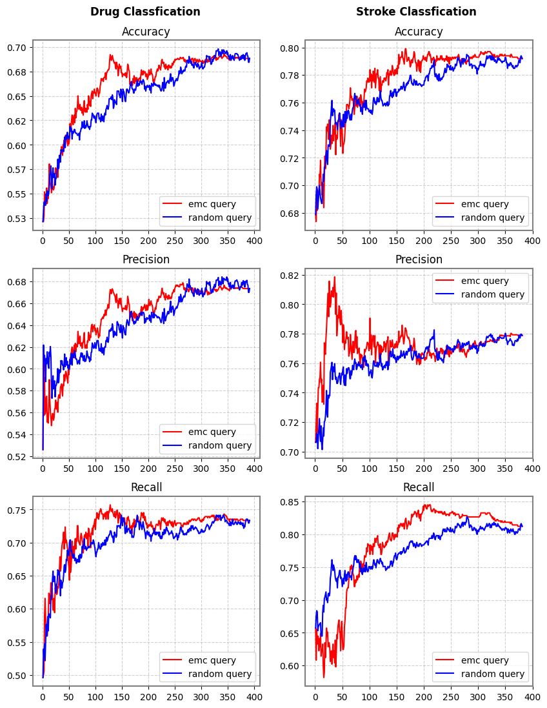

### Expected Model Change (EMC) using Logistic Regression as base model
EMC active machine learning technique meant to choose a sample from pool of data that will bring highest performance increase. The core concept behind EMC is that in order to reduce the model's generalization error, model must change and the sample from data pool that changes the model the most is added at each update step. The model change is approximated by calculating the norm of the gradient of the loss function with respect to model parameters at the selected sample. 

In supervised learning, gradient cannot be calculated with the label. To account for cases when data with no label is queried, change in the gradient based on all the possible label values are used to calculate the norm and summed, hence the name expected model change.

This repository implements EMC for a **binary classification task** using **logistic regression model**.

As with other active learning methods, EMC has a purpose of cherry-picking a set of samples that could yield high model performance without using the whole avaialble dataset. By logging the performance and the sample id chosen at user-designated logging step, users can analyze the samples that positively impacted the performance. 

EMC is prone to outliers in the dataset because outliers tend to bring a large change to the gradient as they are likely to have a large error relative to the model's predictions. So, it is recommended that noisey data should be normalized and preprocessed before using EMC. Another drawback is that EMC is computationally intensive because at every sample-update step, all the samples in the data pool need to be iterated to be added to the model respectively, fitted to the model and gradients calculated to find the sample that changes the gradient the most. 

In this repo, EMC is implemented using sklearn's Logistic Regression (LR), and the model only takes binary labeled data as input. Once data is split into test and train sets, train datset is split into two; one split is for initially training the model and the other for creating a data pool from which a sample will be selected through EMC method. A baseline model that selects samples randomly from the data pool is implemented for performance comparison. As for model performance metric, accuracy, precision and recall can be logged in user-designated directory and log interval. 

Example config:
```
config={
    "emc_dir_path":None,
    "rand_sampling_dir_path":None,

    # number of emc or random sampling simulations to run 
    "n_sim":10,
    
    # ratio [0.0,1.0] of samples to fit model before sampling
    "initial_train_ratio":0.05,
    
    # 'ros'  (random oversampler) OR 'smote'(Synthetic Minority Oversampling)
    "oversample_type":'smote',                  
    
    # ratio [0.0,1.0] OR number of samples
    "test_ratio":0.2,

    # ratio [0.0,1.0] OR number of samples
    "train_minor_label_oversample_ratio":0.2,
    
    "log_freq":20,
    "logger_rand_sampler":None,
    "logger_emc":None
}
```
To address the label-imbalance problem, oversampling function is implemented. To avoid data leakage to the test set from the training set, oversampling is done only on the training set after the label-balanced test set is split up. Users can designate the exact number or the ratio of minor label training samples to oversample through the "train_minor_label_oversample_ratio" parameter in the test_val_train_split_w_oversampling() method in emc.py file.

##### Dependencies
```
python 3.11.8
matplotlib 3.8.4
numpy 1.24.3
pandas 2.2.2
scikit-learn 1.2.2
scipy 1.12.0
seaborn 0.13.2
imblearn 0.12.0

# Additional dependencies for running drug_data notebook
rdkit-pypi 2022.9.5 
```
<br/><br/>
##### Comparison of EMC (red) & random sampling metric plots for 2 tasks:
1. Stroke prediction using health record data\
Source: https://www.kaggle.com/datasets/fedesoriano/stroke-prediction-dataset
2. Anti-bacterial small molecule screening with molecular fingerprint data\
Source: https://github.com/cardonalab/Prediction-of-ATB-Activity

<div style="text-align: center;">

</div>

The figure above shows the change in the accuracy, precision and recall of the model at each update step (x-axis); at each step, a sample is picked from the data pool and added to the LR model. 

These results are based on the model trained on datasets balanced by undersampling major label train datasets to reduce run time.  

We can see from the drug classification that EMC achieves higher performance than the baseline method with smaller amount of samples (update steps), allowing us to identify the samples that are potentially more informative in drawing the decision boundary. From the stroke classification, we observe a tug-of-war between precision and recall; as the precision goes up initially, recall goes down and vice versa as new decision boundary is drawn with the addition of new sample. This possibly indicates that the stroke dataset requires more variance to be able to be classfy samples more precisely.

##### Performance comparison to no-sampling LR model:
|       | Accuracy | Precision | Recall |
|----------|----------|----------|----------|
| Drug | 0.66  | 0.64  | 0.73  |
| Stroke | 0.80  | 0.81  | 0.78  |