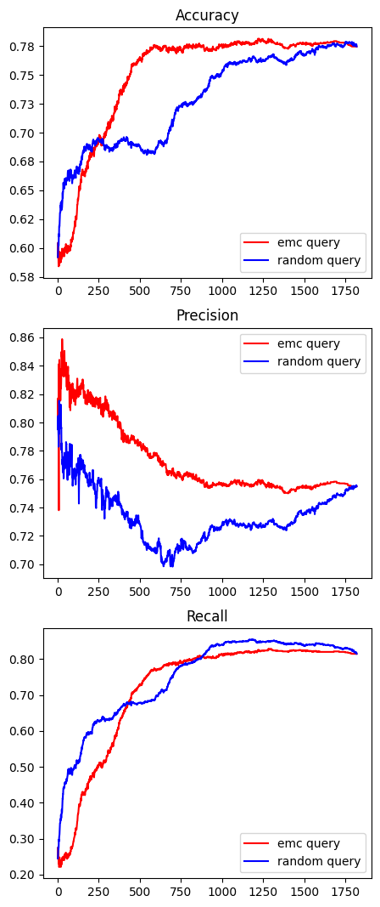
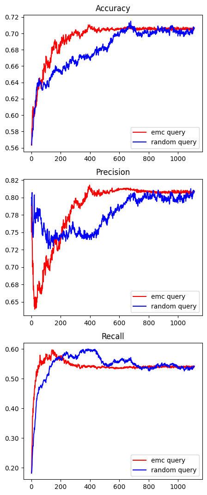

#### Expected Model Change (EMC) using Logistic Regression as base model
EMC active machine learning technique iterates over samples in a data pool to select the sample that changes the gradient of the loss with respect to the weights the most at each update step. The general concept behind EMC is that in order to reduce the generalization error, the model needs to change. In classification task, average change in the gradient based on all the classes are used, hence the name expected model change.

As with other active learning methods, EMC has a purpose of cherry-picking a set of samples that could yield high model performance without using the whole avaialble dataset. By logging the performance and the sample chosen at each update step, users can analyze the samples that positively impacted the performance.

EMC is prone to outliers in the dataset because outliers tend to bring a large change to the gradient as they are likely to have a large error relative to the model's predictions. So, it is recommended that noisey data should be normalized and preprocessed before using EMC. Another drawback is that EMC is computationally intensive because at every sample-update step all the samples in the data pool need to be iterated to be added to the model respectively, fitted to the model and gradients calculated to find the sample that changes the gradient the most. 

In this repo, EMC is implemented using sklearn's Logistic Regression (LR), and the model only takes binary labeled data as input. Once data is split into test and train sets, train datset is split into two, one for initially training the model and the other for creating a data pool from which a sample will be selected through EMC method. A baseline model that selects samples randomly from the data pool is implemented separately for performance comparison. As for measuring the model performance, accuracy, precision and recall are logged in user-designated directory and log interval.

To address the label-imbalance problem, oversampling function is implemented. To avoid data leakage to the test set from the training set, oversampling is done only on the training set after the label-balanced test set is split up; users can designate the exact number or the ratio of minor label training samples to oversample through the "oversample_size" parameter in the train_test_split_oversample() method.

> **Refer to sample ipynb files to view how to apply emc sampling functions in emc.py.**

#### EMC and random sampling comparison metric plots for two different tasks:
1. Stroke prediction using health record data (left)
Source: https://www.kaggle.com/datasets/fedesoriano/stroke-prediction-dataset
2. Anti-bacterial small molecule screening with molecular fingerprint data (right)
Source: https://github.com/cardonalab/Prediction-of-ATB-Activity

<div style="text-align: center;">
 
</div>

```
python 3.11.8
matplotlib 3.8.4
numpy 1.24.3
pandas 2.2.2
scikit-learn 1.2.2
scipy 1.12.0
seaborn 0.13.2

*Dependencies only for emc.py listed 
```